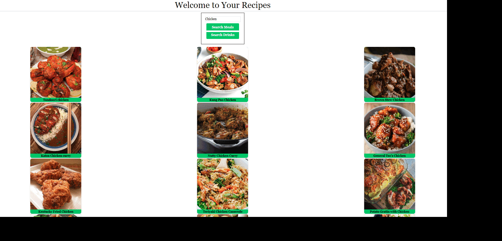

#  Food and Beverage Finder
A collaborative project to create a website that will generate food and drink recipes based on data input.

## User Story
‘’’
AS A group,
WE WANT a functional webpage that allows user to input food or beverage ingredients.
SO THAT the webpage creates food or drink recipes based on chosen ingredients.
WHEN Ingredients are given.
THEN recipes are generated.
WHEN the recipes are selected.
THEN text will appear with the necessary ingredients and recipe instructions.
‘’’

## Acceptance Criteria
‘’’
CREATE a webpage that follows the base idea of a food and drink recipe finder.
CREATE a GitHub Repository
CREATE base HTML.
CREATE style using CSS.
CREATE functionality using JavaScript.
ADD Two APIs.
WHEN food ingredients are entered into search bar (Ex: Beef) and search meals is clicked.
THEN you are presented with meal options.
WHEN you click on a meal.
THEN you are presented with recipe ingredients and recipe instructions.
WHEN drink ingredients are entered into search bar (Ex: Vodka) and search drinks is clicked.
THEN you are presented with beverage options.
WHEN you click on a beverage.
THEN you are presented with recipe ingredients and beverage instructions
‘’’

### Assignment Steps To Completion
‘’’
Created GitHub repository titled food-and-beverage-finder.
Created Item Board in GitHub.
Created WireFrame to brainstorm project idea
Created base HTML (Joshua, Luke).
Created CSS style by implementing TailWind (Luke).
Added functionality through JavaScript (Joshua).
Added two APIs which will be listed below. (Joshua).
TailWind CDN
Listed in this section is the link for tailwind that must be used in order to load the style webpage
<script src="https://cdn.tailwindcss.com%22%3E/</script>
Created a functional webpage that matches the above listed acceptance criteria. Page is responsive and follows the expectations decided on by the group. It lists the search bar that allows the user to input a meal or beverage ingredient such as beef or vodka, to be given results based on the selected ingredients. Webpage was styled according to the collaborative effort of the group.
https://www.themealdb.com/api/json/v1/1/search.php?s=
https://www.themealdb.com/api/json/v1/1/lookup.php?i=${mealID}
https://www.thecocktaildb.com/api/json/v1/1/filter.php?i=${DrinkInput}
https://www.thecocktaildb.com/api/json/v1/1/lookup.php?i=${idDrink}

LINKS TO WEBPAGE AND GITHUB REPO
●	https://brackenluke.github.io/food-and-beverage-finder/GitHub repo
●	https://github.com/brackenluke/food-and-beverage-finder
‘’’

### Screenshot of Functioning Collaborative Project
‘’’
Display GIF: 

‘’’
